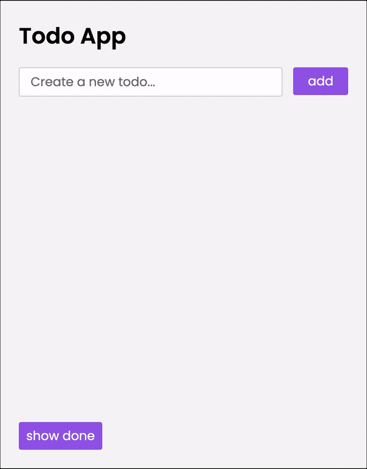
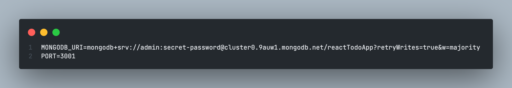

# react-todo-app

This is a simple ToDo application written with NodeJS and React. This is a FullStack application that uses ReactJS for the frontend and NodeJS with Express for the backend. Additionally, MongoDB is used as a database to store the ToDos. The app is inspired by the first part of the online course "FullStackOpen" from the University of Helsinki, which you can read [here](https://fullstackopen.com/en/)..

<br>

**Preview:**



<br>

Click here for live demo on heroku: [**Demo**](https://fullstackopen-react-todo-app.herokuapp.com/)

---

## Instructions

### Prerequisites

To get the application running on your computer, you need MongoDB. You can install MongoDB locally on your computer or use a MongoDB provider. I use MongoDB Atlas for this application. You can create a new account [here](https://www.mongodb.com/basics/clusters/mongodb-cluster-setup) or [here](https://www.makeuseof.com/mongodb-cluster-cloud-free-setup/).

<br>

**Clone this repository**

```bash
$ git clone https://github.com/MiladMKL/fullstack-react-todo-app.git
```

Install the dependencies. Make sure you already have [`nodejs`](https://nodejs.org/en/) & [`npm`](https://www.npmjs.com/) installed in your system.

```bash
$ npm install
```

<br>

After creating a MongoDB Atlas Cluster (link in prerequisites), create a new file named '.env' and store the MongoDB URI in it, as shown below.
Make sure you also set the port to 3001:


<br>
Now run mongo.js to create a new entry in MongoDB:

```bash
node mongo.js <password>
```

**Run it**

```bash
$ npm start
```
